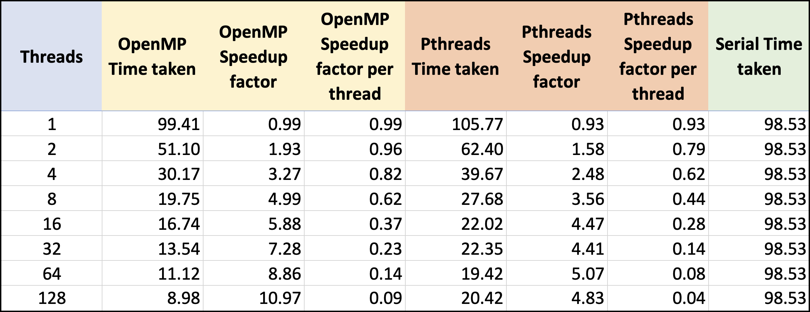
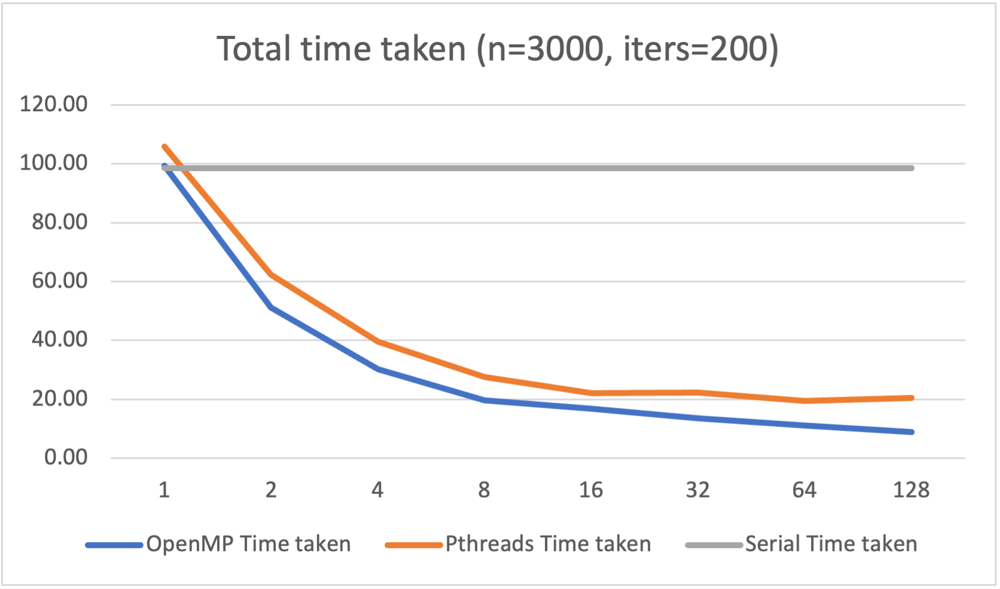
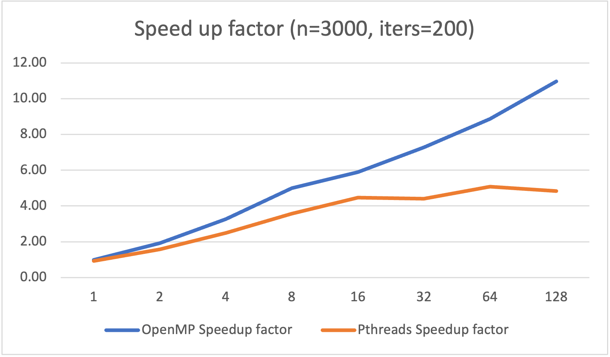
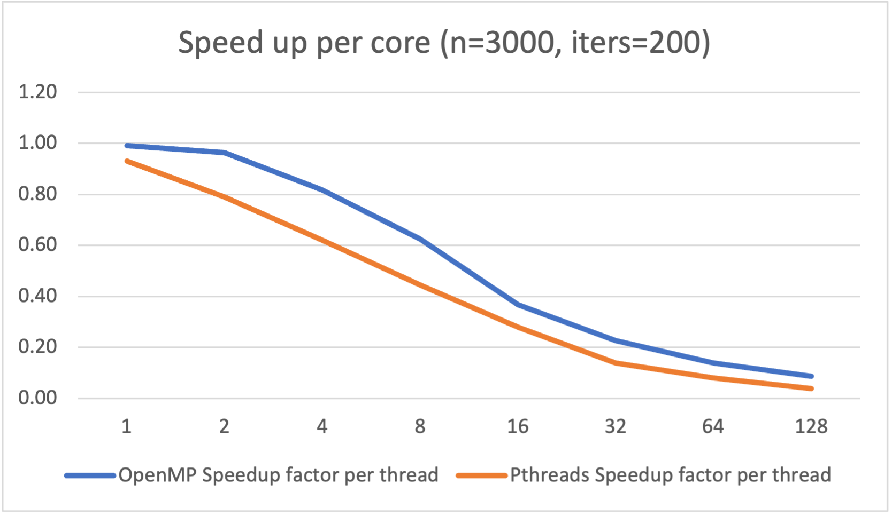

# Homework 2
Parallelize nbody.c for a multicore processor using two different
approaches: PThreads, and OpenMP. You can determine the type of
scheduling and all other aspects of the parallelization, but the basic
idea is to have each thread (processor core) compute some fraction of
the force calculation in parallel. Getting the correct answer is a key
part of getting credit for this assignment, so be sure that you
develop a good testing strategy early. Speedup is another key aspect
-- report on performance improvements as a function of core count for
each strategy. For ease of grading, submit just two source code files
-- nbody_pt.c and nbody_omp.c.

# Answer

Name - Divij Sinha  
cnet - divijs  
UchicagoID - 12364171  

The force calculation of the nbody problem has been parallelised through 2 different approaches here.
We have used both OpenMP and PThreads. 

## Testing strategy  

To test whether the results are right, we use the same random seed across the serial and the parallelised operations. We save the results of the serial operation and do a charwise comparison across the file generated by the llel operation. Everything here was run on the linux.cs cluster to ensure reproducability.

## Setup
### Ease of setup

While the pthread approach took some effort to set up, the openmp approach works almost directly out of the box. 
It required minimal code refactoring. For the pthreads approach too, we could wrap the main function around a wrapper that unpacks the required params and do other bookkeeping to ensure less messing with the original serialised functions.

### Setup details

#### OpenMP

For openmp, we ensure that the common variables are declared as shared. All other variables used in the loops are declared within the loop, therefore there is no need to declare them. Also, as only one thread will write to a partcular `p[i]`, there are no race conditions or writing to the same memory therefore no locks or reductions are necessary. Also, using dynamic scheduling gives us a slight increase in speed so we use it. I also tried the `collapse(2)` flag to parallelise the nested for loops but it provided no real improvement. Dynamic scheduling did in fact prove to be a better approach, and letting the chunk sizes for this be automatically defined did better than the manual tries I had trying to finetune the dynamic schedule. 

#### PThreads

For pthreads, we have to create a separate structure with all the necessary parameters as we do the division of tasks ourselves. We also ensure the remainder problem is taken care of. As with the other case, there are no race conditions or writing to the same memory therefore we do not need a `mutexlock`.

## Increase in performance

The increase in performance looks as follows. We run each of these methods for all of the mentioned core counts (with `n=3000, iters=200`) 5 times, and then take the average.

Breaking it down, we have the follwoing insights - 

### Time taken

As we can see, the time taken almost plateaus around 8 cores for both methods. This is mainly because we have only 8 physical cores. It also somewhat shows the Amdahl limits of our parallelisation. As directed, we only parallelise the per particle force calculations; the iterations still happen serially. We also do not parallelise the writing to the file, or generation of points which leads to a chunk of tasks that need to be done serially. 

### Speed up

The speed up as we can see also plateaus around 8 cores for the Pthreads approach. This again is probably a limitation of the number of physcial cores. As we look at the OpenMP approach however, there is some benefit to adding threads even if we don't have physical cores. Obviously, this approach also has diminishing returns, for example when we jump from 64 to 128 threads, a 2x jump, we only get a 1.2x reduction in time.  However, it is still a stark improvement over Pthreads and a linear increase in speed with a quadratic increase in threads (not physical cores!) is still a great result.

### Per core speed up

The fact that the speed up does not scale directly with the threads is visible here. As we can see, adding an extra core (moving 1 to 2) for the OpenMP approach is the most efficient addition with the core halfing the time. For all other increases in cores, we do not nearly get the speed up ratio of close to 1 as we could expect.

## Final reflections
While there is immense speed up that does happen from just this, we could try parallelising other parts of the file for a further increase in speed. Also, while increasing the threads does seem to help (atleast in OpenMP), we are certainly capped by the number of physical cores. The OpenMP approach requires little to no refactoring, and also seems to perform better than the pthreads approach. In this specific problem, we also do not run into the problems of writing to the same memory or race conditions like reading the memory before its written to etc. This enables us to further not have any waiting in any of the force calculations, allowing us to eke out a little more performance from the parallelised approaches.